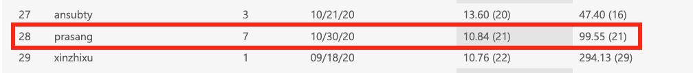

# L2RPN 2020 - Robustability Track 

### [Competition Link](https://competitions.codalab.org/competitions/25426)

### Methodology
Our methodology is derived from [L2RPN WCCI 2020 Competition : A3C based possible solution](https://github.com/ZM-Learn/L2RPN_WCCI_a_Solution). The strategy used is to reduce the action space and train two A3C models (main and backup models) with different training parameters.

We used main A3C model as it is available but **improved the backup A3C model** by re-training on different training parameters and reward. 

Params | Main Model | Backup Model
------------ | ------------- | -------------
EPIOSDES_TRAIN (scenarios used for training an agent) |	3000 | 1518
EPSILON (Exploration prob) |	0.9 | 0.3
ACTOR_LR |	0.001 | 0.001
CRITIC_LR |	0.005 | 0.005
DISCOUNT_FACTOR	| 0.7 | 0.6 
HIDDEN_LAYERS |	1000 , 1000 , 1000 | 1000 , 1000 , 1000
THREADS (Number of agents) |	16 | 4
TRAINING_BATCH_SIZE	 | 128 | 128
STATE_SIZE |	1120 | 1120
ACTION_SIZE	| 1008 | 1008
REWARD	| L2RPNReward | LinesReconnectedReward

### Final Submission to Competition
Our final submission could be found here : example_submissions/submission_new_10292020

**Test Phase Performance**
Score : **10.84**

### Challenges
* Time consumed in learning to use python package for RL model - Grid2Op
  - Though the package provides full documentation and starting scripts, it was difficult to explore the action space and observation space with limited examples.
* Limited experimentation due to infrastructure limitations and model complexity
  - Model training needs GPU usage with consistent connection to the servers for long duration due to complexity
  - It took almost a week to re-train the backup model and even then we could train for only ~1500 episodes though we initally planned for 5000 on CPU cores.
  
### Enhancements
* The model could be improved further by continuing the training of the backup model to 5000 episodes. 
* We used L2RPN WCCI 2020 environment that was used by the original model. We could change the environment to l2rpn_neurips_2020_track1_small to experiment for additional scenarios.
* Action space (100 selected + 200 random + redispatch actions) that was reduced by the original model was not changed due to lack of time and infrastructure. We could improve the model by experimenting with different sets of action space.

### References 
* [A3C based solution](https://github.com/ZM-Learn/L2RPN_WCCI_a_Solution) : Used as baseline
* [L2RPN Baselines](https://github.com/rte-france/l2rpn-baselines/tree/master/l2rpn_baselines)
* [Grid2Op starting material](https://github.com/rte-france/Grid2Op/tree/master/getting_started)
* [How A3C Works ?](https://medium.com/emergent-future/simple-reinforcement-learning-with-tensorflow-part-8-asynchronous-actor-critic-agents-a3c-c88f72a5e9f2)
* [Competition Results](https://competitions.codalab.org/competitions/25426#results)

### Contributors
* [Vishakha Bansal](https://github.com/vishakha-bansal)
* [Prasang Gupta](https://github.com/prasang-gupta)